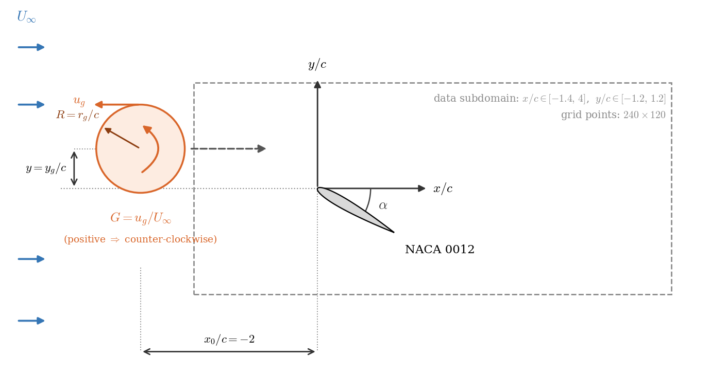
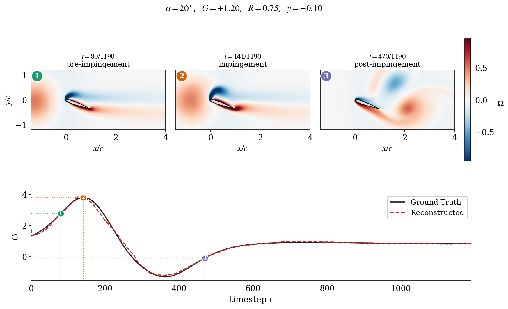
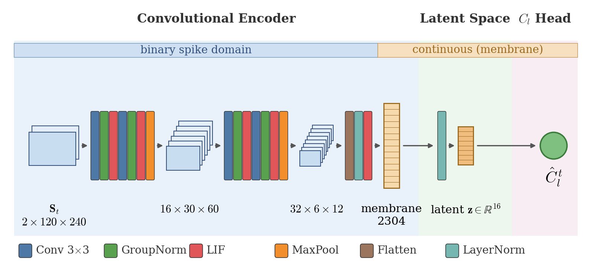
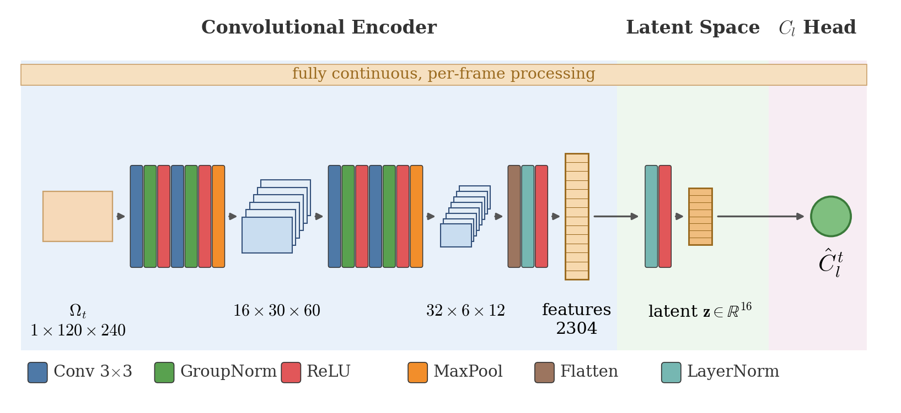
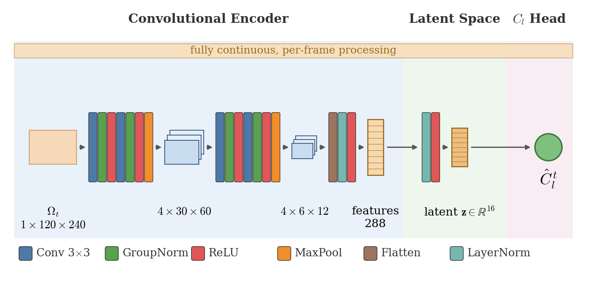
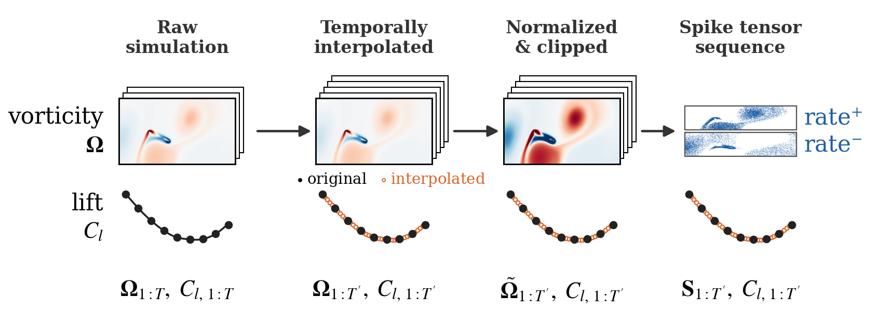

# Spiking Neural Networks for Lift Coefficient Reconstruction in Extreme Vortex–Gust Airfoil Interactions

>**Master thesis**: Spiking Neural Networks for Lift Coefficient Reconstruction in Extreme Vortex–Gust Airfoil Interactions

>**Author**: Jaume Manresa Rigo

>**Tutor**: Iacopo Tirelli


The present codebase focuses on a **Spiking Neural Network (SNN)** that reconstructs the instantaneous sectional lift coefficient `Cl(t)` of a NACA 0012 airfoil directly from time-resolved vorticity fields `ω(x, y, t)` (encoded as **binary spike trains**) during **extreme vortex–gust encounters**. The SNN model is evaluated as well as benchmarked against two conventional (non-spiking) CNN baselines to quantify the trade-off between **reconstruction accuracy** and **estimated inference energy**.

This repository contains the full, reproducible pipeline behind the master thesis: dataset temporal interpolation, spike encoding, training, accuracy evaluations, energy-efficiency evaluations, and figure generation.


---

## Research context

### Abstract

> Extreme vortex-gust interactions can produce large and rapidly varying aerodynamic loads, motivating estimation methods that combine accuracy with low computational cost for future onboard applications. This requirement is particularly relevant because conventional neural networks may demand substantial processing power, whereas the human brain is estimated to perform approximately 10¹⁵–10¹⁶ synaptic operations per second while consuming only 10–20 W, illustrating the potential of sparse and event-driven computation. Inspired by this efficiency, this thesis investigates whether a Spiking Neural Network (SNN) based architecture can reconstruct the instantaneous lift coefficient from time-resolved vorticity fields encoded as binary spike trains. The proposed framework uses a rate-based spike encoding technique with a convolutional SNN composed of Leaky Integrate-and-Fire neurons, trained using stateful truncated backpropagation through time. The methodology is evaluated using 155 numerical simulations of a NACA 0012 airfoil covering different angles of attack and vortex-gust conditions, while ablation studies assess the influence of input temporal resolution, spike encoding, training strategy, and latent space dimension. On the test set, the reference SNN achieves a mean relative L₂ error of **11.33%** and a mean cosine similarity of **0.9919**. Although a parameter-matched convolutional neural network (CNN) provides higher reconstruction accuracy, it requires approximately **17 times more** estimated arithmetic inference energy, whereas the SNN remains competitive with an energy-matched CNN. These results indicate that spike-based processing can preserve sufficient aerodynamic information for accurate lift reconstruction while offering a more energy-efficient alternative for future embedded aerodynamic estimation.

**Keywords:** Spiking Neural Networks, neuromorphic computing, extreme aerodynamics, vortex–gust airfoil interactions, energy-efficient inference.

### Research questions

The thesis is organised around six questions that this codebase was built to answer:

1. Can a convolutional SNN reconstruct `Cl` from spike-encoded vorticity fields for **unseen** vortex–gust encounters?
2. How do the **temporal resolution** of the dataset and the **spike-encoding scheme** affect the preservation of load-relevant information?
3. Does preserving the neuronal **membrane states** across training windows (stateful training) improve reconstruction over a non-stateful strategy?
4. What **latent-space dimension** is needed to compress the spike-encoded flow without significant accuracy loss?
5. How does performance vary across **angle of attack, gust intensity, and gust rotation**?
6. How does the SNN compare with CNN baselines at **equal trainable capacity** and at **equal energy budget**?

---

## Problem in one picture

```
   Vorticity field ω(x,y,t)          Spike encoding            Spiking encoder            Lift
   (120 × 240 per frame)      ─────►  (rate / delta)   ─────►     (SNN_Model)     ─────►   Cl(t)
   over an extreme gust                                        2 conv spiking (LIF)      (scalar per
   encounter                                                   blocks + latent + readout   time step)
```

The model is **decoder-free**: it reads the encoded vorticity sequence and regresses `Cl` at every time step, minimising the **MSE** between the reconstructed and ground-truth lift histories.

### The physical setup

Each simulation places a **NACA 0012** airfoil at an angle of attack `α`, with an incoming **Taylor vortex** (the gust) released upstream at `x₀/c = −2` and convected onto it by the free stream `U∞`. The gust is described by three non-dimensional parameters (strength `G`, size `R`, and vertical offset `y`) and the vorticity field is stored on the outlined `240 × 120` data subdomain.



### What the model actually does

The figure below shows one held-out test encounter (`α = 20°`, gust `G = +1.2`). The top row is the ground-truth vorticity field at three instants: the vortex approaching (**pre-impingement**), striking the airfoil at peak lift (**impingement**), and convecting downstream (**post-impingement**). The bottom panel compares the **ground-truth** lift history against the SNN's **reconstruction** from the spike-encoded field alone; the numbered markers tie the three snapshots to their instants on the lift curve. Despite seeing only sparse binary spikes, the SNN closely tracks the full transient (this case: relative L₂ error ≈ 5.5%).



---

## Key results

Reference SNN vs. the two CNN baselines on the held-out test set. Reconstruction metrics are **means** (medians in parentheses). Energy values are **analytical, operation-level estimates** (not direct hardware measurements) and should be read as indicators of *relative* arithmetic efficiency.

| Quantity | **SNN** | Parameter-matched CNN | Energy-matched CNN |
|---|---|---|---|
| Relative L₂ error | 0.1133 (0.0801) | **0.0428 (0.0288)** | 0.1191 (0.0893) |
| Cosine similarity | 0.9919 (0.9971) | **0.9986 (0.9996)** | 0.9901 (0.9965) |
| Trainable parameters | 58 251 | 58 097 | 5 765 |
| MACs / time step | 36.9 k | 95.4 M | 5.71 M |
| ACs (spike-driven) / time step | 28.15 M | 0 | 0 |
| Estimated energy / time step | 25.51 µJ | 438.94 µJ | 26.25 µJ |

**Takeaways:**

- **Feasibility.** Spike-encoded vorticity retains enough load-relevant information for `Cl(t)` reconstruction (mean rel. L₂ ≈ 11%, cosine similarity ≈ 0.992).
- **Equal capacity.** At essentially identical parameter counts, the parameter-matched CNN is more accurate, but the SNN uses **~17× less** estimated inference energy (a **~94% reduction**).
- **Equal energy.** Under a matched energy budget, the SNN and CNN reach comparable accuracy (the SNN is marginally better on mean errors), while the SNN packs **~10× more trainable parameters** into the same energy envelope.
- **Where errors concentrate.** Reconstruction is hardest during the fast gust-induced transient and for **strong gusts** (`|G| > 2.5`); mild/medium gusts are reconstructed with median relative errors below ~8%.

---

## Repository structure

```
SNN-vortex-gust-lift-reconstruction/
├── main/                       # All runnable scripts and shared modules
│   ├── dataset_interpolation.py    # (1) Build a temporally up-sampled dataset
│   ├── pre_encoder.py              #     Spike-encoding pipeline (imported module)
│   ├── loss.py                     #     MSE loss  (imported module)
│   ├── train_SNN.py                # (2) Train the spiking neural network
│   ├── train_parameter_matched.py  # (2) Train the parameter-matched CNN baseline
│   ├── train_energy_matched.py     # (2) Train the energy-matched CNN baseline
│   ├── test.py                     # (3) Evaluate a model (accuracy metrics + figures)
│   ├── efficiency_metrics.py       # (4) Measure compute / energy efficiency
│   ├── box_plots.py                # (5) Accuracy comparison box plots
│   ├── efficiency_metrics_plots.py # (5) Efficiency comparison bar charts
│   └── TFM_report_plots.py         # (5) Complementary figures for the report
│
├── models/                     # Model definitions
│   ├── SNN.py                      # SNN_Model: the SNN architecture
│   ├── parameter_matched.py        # ParameterMatchedCNN baseline
│   └── energy_matched.py           # EnergyMatchedCNN baseline
│
├── datasets/                   # Input data (see "Dataset availability" below)
│   ├── Dataset_original/            # Placeholder for raw simulation data (empty)
│   ├── Dataset_interpolated_cubic_spline_N4/   # Placeholder for interpolated version (empty)
│   └── RD_list_FT2023.xlsx         # Per-case gust parameters (G, R, y, ...)
│
├── training/                   # Training checkpoints, grouped by model
│   ├── SNN_training/
│   ├── Parameter_matched_training/
│   └── Energy_matched_training/
│
├── results/                    # test.py output, grouped by model
│   ├── SNN_results/
│   ├── Parameter_Matched_results/
│   └── Energy_matched_results/
│
├── efficiency_results/         # efficiency_metrics.py output, grouped by model
│   ├── SNN_results/
│   ├── Parameter_Matched_results/
│   └── Energy_matched_results/
│
├── report_figures/             # Figures for the thesis report
├── requirements.txt            # Dependencies to ensure compatibility with the code
└── README.md
```

The numbers `(1)…(5)` indicate the typical order in the workflow.

---

## The three models

| Model | File | Class | Role |
|-------|------|-------|------|
| **SNN** | `models/SNN.py` | `SNN_Model` | The proposed spiking encoder: two convolutional spiking (LIF) blocks + latent bottleneck + linear `Cl` readout. |
| **Parameter-matched CNN** | `models/parameter_matched.py` | `ParameterMatchedCNN` | Dense CNN with (approximately) the **same number of parameters** as the SNN. |
| **Energy-matched CNN** | `models/energy_matched.py` | `EnergyMatchedCNN` | Dense CNN with reduced widths so its estimated **per-step energy** approaches the SNN's. |

Both CNN baselines read the **continuous vorticity** (no spike encoding) and reconstruct `Cl` frame by frame, so the comparison isolates the effect of the spiking computation and its lossy binary input representation.

An architecture schematic of each model is shown below.

**SNN — `SNN_Model`**



**Parameter-matched CNN — `ParameterMatchedCNN`**



**Energy-matched CNN — `EnergyMatchedCNN`**



---

## Workflow

### 1. Prepare the dataset (run once)

`dataset_interpolation.py` densifies the time axis of `Dataset_original/` by inserting interpolated frames, producing `Dataset_interpolated_<method>_N<N>/` as a sibling folder under `datasets/`.

```bash
python main/dataset_interpolation.py --method cubic_spline --n 4 --angles 20 30 40 50 60
```

This temporal interpolation is the first stage of the pre-processing pipeline that turns a raw vorticity field into the network's spike-train input. The full pipeline — temporal interpolation, robust normalization and clipping, then rate spike-encoding into the positive/negative spike channels — is illustrated below, with the lift signal `Cl` kept time-aligned at every stage. The later stages (normalization, clipping, and spike-encoding) are applied on the fly during training and are configured via the training scripts (see [Spike encoding](#spike-encoding)).



### 2. Train

Each trainer writes a timestamped run folder under its own subfolder of `training/`:

```bash
python main/train_SNN.py                 # → training/SNN_training/<run>/
python main/train_parameter_matched.py   # → training/Parameter_matched_training/<run>/
python main/train_energy_matched.py      # → training/Energy_matched_training/<run>/
```

Every run folder contains:

| File | Contents |
|------|----------|
| `config_snapshot.txt` | The full configuration used (for reproducibility) |
| `dataset_split.txt` | The train / val / test case listing |
| `best.pth` / `epoch_<N>.pth` / `final.pth` | Model weights |
| `loss_curves.pt` | Training/validation loss per epoch |

Training settings (encoding, dataset, split, architecture, hyperparameters) are edited directly in the `CONFIG` blocks at the top of each training script.

### 3. Evaluate a trained model

`test.py` loads one checkpoint folder, rebuilds the exact training configuration from its `config_snapshot.txt`, runs inference on the held-out test cases, and writes accuracy metrics and figures.

Point it at a run by editing `model_folder_name` near the top of `test.py` (prefixed with the training-type folder), then:

```bash
python main/test.py
```

Output is a timestamped folder under `results/<model>_results/<run>/` containing `config_snapshot.txt`, `dataset_split.txt`, `accuracy_metrics.csv`, and figures under `summary/`, `latent/`, and `samples/`.

### 4. Measure efficiency

`efficiency_metrics.py` reports parameter count, spike activity, MAC/AC operation counts, estimated inference energy, and memory for a given checkpoint.

```bash
python main/efficiency_metrics.py
```

Output is `efficiency_results/<model>_results/<run>/` (`efficiency_metric_summary.txt` and
`efficiency_metrics.json`).

### 5. Compare & plot

| Script | Reads | Produces |
|--------|-------|----------|
| `box_plots.py` | `accuracy_metrics.csv` from several `results/…` folders | Per-metric accuracy box plots |
| `efficiency_metrics_plots.py` | `efficiency_metrics.json` from several `efficiency_results/…` folders | Efficiency comparison bar charts |
| `TFM_report_plots.py` | (self-contained / raw data) | Complementary figures for the report |

All figures are written under `report_figures/`. The experiments to compare are listed by name in the `CONFIGURATION` block of each plotting script.

---

## Spike encoding

The vorticity field is converted to spikes by `pre_encoder.py`. Encoding is selected via
the `ENCODING` setting in the training scripts:

- **`rate`** — robust `P99` normalization followed by the amplified Bernoulli transfer function `p = min(1, GAIN · |x|^GAMMA)`, with separate positive/negative channels (the encoding used by the reference model).
- **`delta`** — spikes on significant frame-to-frame changes (`|Δx| ≥ θ`).
- **`rate+delta`** — hybrid, combining both channels.

Encoded sequences are cached (`.pt` files under `datasets/<dataset>/cache/`) so subsequent runs skip re-encoding.

---

## Dataset availability

The study uses **155 two-dimensional direct numerical simulations** of a **NACA 0012** airfoil at chord-based Reynolds number **Re = 100**, across angles of attack `α ∈ {20°, 30°, 40°, 50°, 60°}`. For each angle there is one undisturbed baseline plus 30 disturbed cases (5 × 31 = 150 gusts + 5 undisturbed references). Disturbances are coherent **Taylor-vortex gusts** of varying strength, size, direction, and vertical position (parameters `G`, `R`, `y` per "RD" case, listed in `RD_list_FT2023.xlsx`). Each case stores:

- **Vorticity fields** `ω(x, y, t)` — `120 × 240` per frame (`vorticity/vort_a<angle>/…`).
- **Lift coefficient** `Cl(t)` — the scalar target (`lift/lift_a<angle>/…`).

`Dataset_original/` holds the raw `.mat` / `.csv` files; the interpolated dataset holds `.npy` files with the same layout. The dataset location is auto-detected under `datasets/`. To point at data stored elsewhere (e.g. on a server), set the `THESIS_DATA_ROOT` environment variable to your `datasets/` directory.

> ### The dataset is **not** included in this repository
>
> The raw dataset is large, so `datasets/Dataset_original/` and `datasets/Dataset_interpolated_cubic_spline_N4/` are shipped here as **empty placeholders**. To reproduce the experiments:
> 1. **Download the original dataset**, produced by Fukami and Taira for their study on the low-dimensional representation of extreme vortex–gust airfoil interactions, from the Open Science Framework: **<https://doi.org/10.17605/OSF.IO/7VSH8>**. Organise its contents under `datasets/Dataset_original/` following the exact structure shown below.
> 2. **Regenerate the interpolated dataset** used to train and evaluate the reference SNN by running `dataset_interpolation.py` (Step 1 of the workflow), which applies the cubic-spline temporal interpolation described in the thesis. The interpolated data is a derived version of the original and is not distributed separately.
>
> **Reference**: K. Fukami and K. Taira, *"Grasping extreme aerodynamics on a low-dimensional manifold"*.

### Expected structure of `Dataset_original/`

The downloaded data is **not** organised the way this codebase expects. After downloading, the files must be arranged into the following structure and naming convention (the loaders locate each case by these exact paths and file names):

```
datasets/Dataset_original/
├── vorticity/
│   ├── vort_a20/
│   │   ├── Vort_AoA20_base.mat      # undisturbed baseline
│   │   ├── Vort_AoA20_RD1.mat       # disturbed case RD1
│   │   ├── Vort_AoA20_RD2.mat
│   │   ├── ...
│   │   └── Vort_AoA20_RD30.mat      # 31 files: base + RD1…RD30
│   ├── vort_a30/                    # same layout, Vort_AoA30_*.mat
│   ├── vort_a40/                    # Vort_AoA40_*.mat
│   ├── vort_a50/                    # Vort_AoA50_*.mat
│   └── vort_a60/                    # Vort_AoA60_*.mat
└── lift/
    ├── lift_a20/
    │   ├── Lift_AoA20_base.csv       # undisturbed baseline
    │   ├── Lift_AoA20_RD1.csv        # disturbed case RD1
    │   ├── Lift_AoA20_RD2.csv
    │   ├── ...
    │   └── Lift_AoA20_RD30.csv       # 31 files: base + RD1…RD30
    ├── lift_a30/                     # same layout, Lift_AoA30_*.csv
    ├── lift_a40/                     # Lift_AoA40_*.csv
    ├── lift_a50/                     # Lift_AoA50_*.csv
    └── lift_a60/                     # Lift_AoA60_*.csv
```

Naming rules (case-sensitive):

- **Angle folders**: `vort_a<angle>` and `lift_a<angle>` with `<angle> ∈ {20, 30, 40, 50, 60}`.
- **Vorticity files**: `Vort_AoA<angle>_<case>.mat`, where the MATLAB file holds the vorticity field array under the key `omg_box`.
- **Lift files**: `Lift_AoA<angle>_<case>.csv`, a single-column (headerless) `Cl(t)` history.
- **Case identifiers**: `<case>` is either `base` (the undisturbed reference) or `RD1`…`RD30` (the disturbed cases). Each angle folder therefore holds **31 files**, for a total of **155** vorticity/lift pairs. The `G`, `R`, `y` parameters of each `RD` case are listed in `datasets/RD_list_FT2023.xlsx`.

---

## Setup

Developed and tested with **Python 3.14** and, for training, an NVIDIA GPU with CUDA.
Dependencies are pinned in `requirements.txt`.

```bash
# 1. Create and activate a virtual environment
python -m venv TFM_TESTING_venv
# Windows (PowerShell):
.\TFM_TESTING_venv\Scripts\Activate.ps1
# Linux / macOS:
source TFM_TESTING_venv/bin/activate

# 2. Install PyTorch (CUDA 12.6 build) first
pip install torch==2.11.0+cu126 torchvision==0.26.0+cu126 \
    --index-url https://download.pytorch.org/whl/cu126

# 3. Install the rest
pip install -r requirements.txt

# 4. Verify
python -c "import torch, snntorch; print(torch.__version__, torch.cuda.is_available())"
```

**Notes**
- `requirements.txt` is UTF-16 encoded; modern `pip` handles this automatically.
- It lists `appnope` (a harmless macOS-only package) — ignore the single install error it
  raises on Windows/Linux; nothing in this codebase imports it.
- The `torch`/`torchvision` `+cu126` builds live on the PyTorch index, not PyPI, which is
  why step 2 installs them explicitly first.

